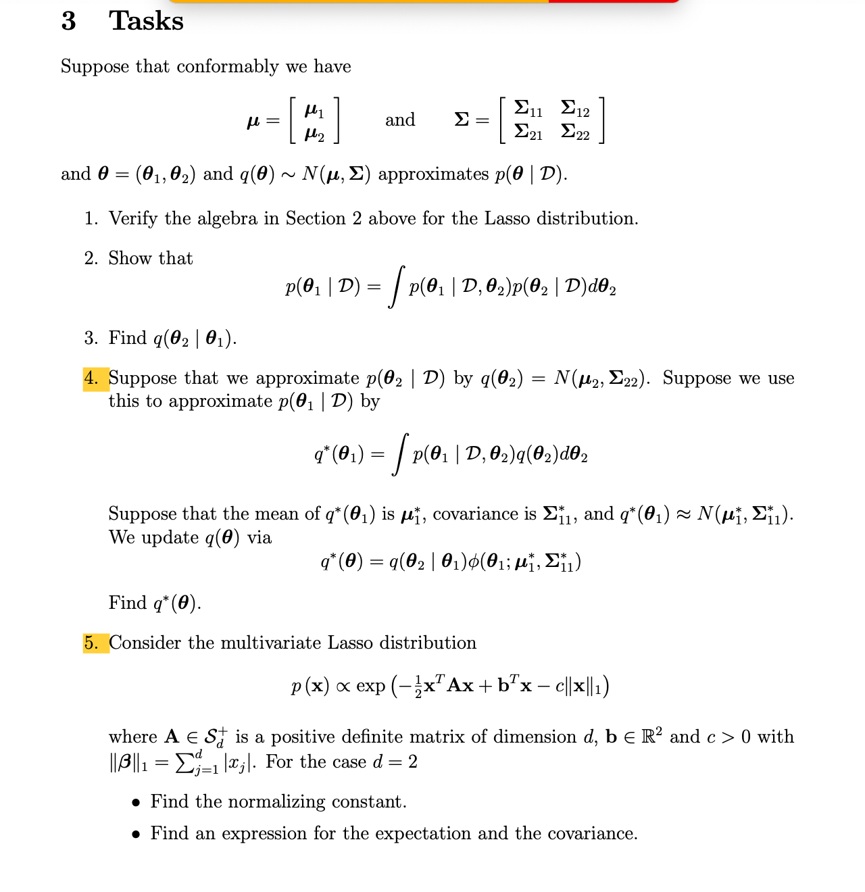
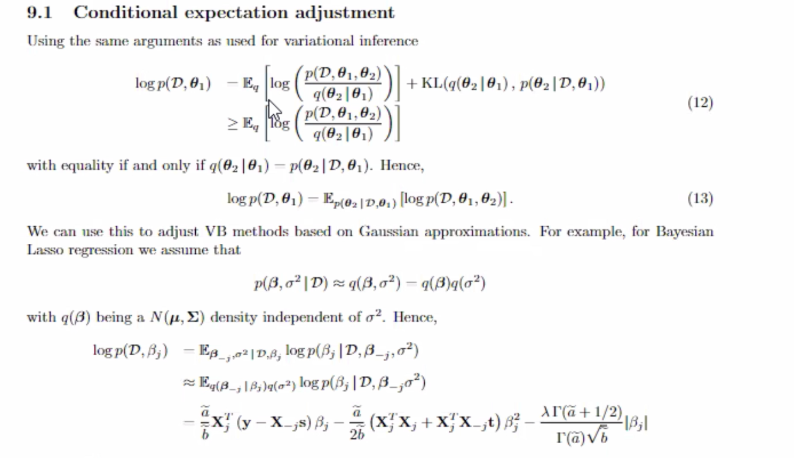

# Research Idea

### Setting

$\theta_1 = (\beta,\sigma^2), \theta_2 = a$

### Task 3:

$q(\theta_2|\theta_1): N(\mu_1+\Sigma_{21}\Sigma_{11}^{-1}(\theta_1-\mu_1), \Sigma_{22}-\Sigma_{21}\Sigma_{11}^{-1}\Sigma_{12})$

### Task 4:

#### Approximate Local 

Assume we approximate:  $p(\theta_2|D)$ by $q(\theta_2) = N(\mu_2,\Sigma_{22})$

Optimal Approximation:  $p(\theta_1|D)$ by $q^*(\theta_1) = \int p(\theta_1|D,\theta_2)q(\theta_2)d\theta_2 $ with $N(\mu_1^*,\Sigma_{11}^*)$

## Derivation Result

$Bivariate Normal$

Normalizing constant of multivariate **B**ayesian lasso:
$$
\text{Let } \mu_1 = A^{-1}(b-c),\mu_2 = A^{-1}(b_1-c,-b_2-c),\mu_3 = A^{-1}(-b_1-c,b_2-c),\mu_4 = A^{-1}(b+c)  ,\Sigma = A^{-1}\\

Z(a,b,c) = \frac{\Phi(\frac{\mu_1}{\sigma_1}, \rho)}{\phi(A\mu_1,\Sigma)} + \frac{\Phi(\frac{\mu_2}{\sigma_2}, \rho)}{\phi(A\mu_2,\Sigma)} + \frac{\Phi(\frac{\mu_3}{\sigma_3}, \rho)}{\phi(A\mu_3,\Sigma)} + \frac{\Phi(\frac{\mu_4}{\sigma_4}, \rho)}{\phi(A\mu_4,\Sigma)}
$$

Expectation of multivariate **B**ayesian lasso: 
$$
\text{Let } \mu_1 = A^{-1}(b-c),\mu_2 = A^{-1}(b_1-c,-b_2-c),\mu_3 = A^{-1}(-b_1-c,b_2-c),\mu_4 = A^{-1}(b+c)  ,\Sigma = A^{-1}\\
\textit{A}: MTN_{+}(\mu_A,\Sigma), \textit{B}: MTN_{+}(\mu_B,\Sigma), \textit{C}: MTN_{+}(\mu_C,\Sigma), \textit{D}: MTN_{+}(\mu_D,\Sigma)\\

E[x] = Z^{-1}[\frac{\Phi(\frac{\mu_1}{\sigma_1}, \rho)}{\phi(A\mu_1,\Sigma)} E[A] + \frac{\Phi(\frac{\mu_2}{\sigma_2}, \rho)}{\phi(A\mu_2,\Sigma)}E[B] * [1,-1]^T + \frac{\Phi(\frac{\mu_3}{\sigma_3}, \rho)}{\phi(A\mu_3,\Sigma)}E[C]* [-1,1]^T  + \frac{\Phi(\frac{\mu_4}{\sigma_4}, \rho)}{\phi(A\mu_4,\Sigma)}E[D]]
$$

Covariance of multivariate **B**ayesian lasso: 

$$
E[xx^T] = Z^{-1}[\frac{\Phi(\frac{\mu_1}{\sigma_1}, \rho)}{\phi(A\mu_1,\Sigma)} E[AA^T] + \frac{\Phi(\frac{\mu_2}{\sigma_2}, \rho)}{\phi(A\mu_2,\Sigma)}E[BB^T]\begin{bmatrix}
1,-1\\
-1,1\\
\end{bmatrix} + \frac{\Phi(\frac{\mu_3}{\sigma_3}, \rho)}{\phi(A\mu_3,\Sigma)}E[CC^T]\begin{bmatrix}
1,-1\\
-1,1\\
\end{bmatrix} + \frac{\Phi(\frac{\mu_4}{\sigma_4}, \rho)}{\phi(A\mu_4,\Sigma)}E[DD^T]]\\
$$

$$
Cov(x) = E[xx^T] - E[x]E[x]^T
$$

$\theta$ multidimensional 

$q(\theta_2|\theta_1): N(\mu_1+\Sigma_{21}\Sigma_{11}^{-1}(\theta_1-\mu_1), \Sigma_{22}-\Sigma_{21}\Sigma_{11}^{-1}\Sigma_{12})$

#### Approximate Global

$$
q^{\star}(\theta) = q(\theta_2|\theta_1)\phi(\theta_1;\mu_1^*,\Sigma_{11}^*)\\
q^*(\theta) :  N_p(\mu_1 + \Sigma_{21}\Sigma_{11}^{-1}(\theta_1-\mu_1)+\mu_1^*, \Sigma_{22}-\Sigma_{21}\Sigma_{11}^{-1}\Sigma_{12}+\Sigma_{11}^*)
$$

​		

### Question 1.24

1 Q4: Product of one multivariate normal and an univariate normal, not sure its posterior

​	Problem: CURRENT RESULT ADDING ONLY WORK when dimension of theta1 and theta2 are equal!

2 Log trick meet negative value

### Question 1.31

1. Posterior density plot remark

2. Code check

3. Next step

   

   

