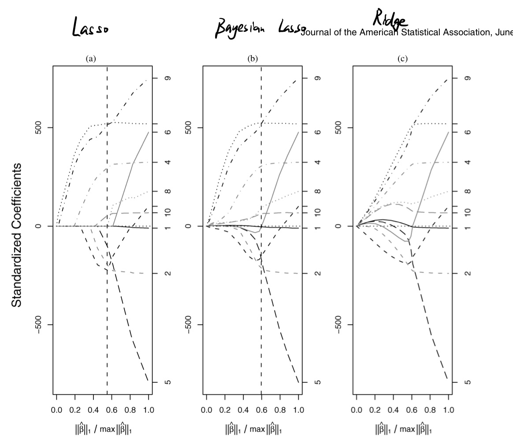
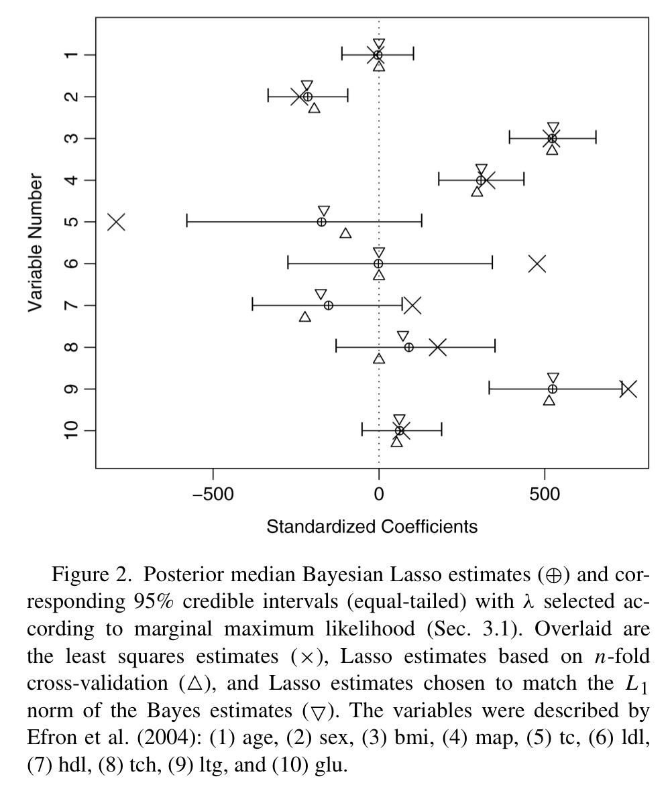
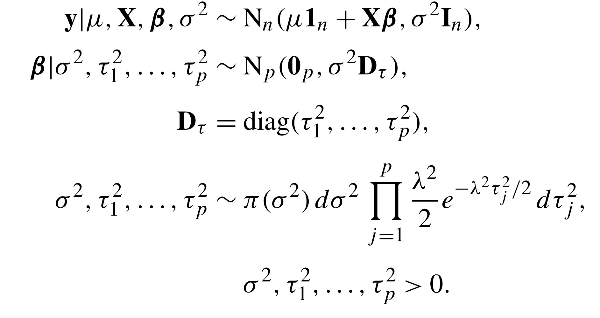

# Bayesian Lasso Regression

## 1 Introduction

### Lasso: Least absolute shrinkage and selection operator

$$
\hat{\beta^{lasso}} = argmin_{\beta} ||y-X\beta||_2 +\lambda||\beta||_1
$$

### Model Specifitation

$$
min_\beta(\tilde{y}-X\beta)^T(\tilde{y}-X\beta) + \lambda \sum_{j=1}^p |\beta_j|, \tilde{y} = y - \bar{y}\textbf 1_n , \lambda \geq 0
$$

Lasso Estimates can be computed through a modification of LARS algorithm (Least Angle Regression)

1. L1- Penalized regression method
   $$
   min_\beta(\tilde{y}-X\beta)^T(\tilde{y}-X\beta) + \lambda \sum_{j=1}^p |\beta_j|, \tilde{y} = y - \bar{y}\textbf 1_n , \lambda \geq 0
   $$

   Lasso Estimates can be computed through a modification of LARS algorithm (Least Angle Regression)

2. used for selection of the subset of variables
3. The absolute values of weight will be reduced, and many tend to be zeros
4. As $\lambda$ Increase, $\beta$  tends to be more zero
5. **Nature of L1 penalty causes some coefficients to be shrunken to 0 EXACTLY**

#### Lasso from bayesian point of view

Lasso estimate can be viewed as a posterior mode estimates when have double exponential priors
$$
\hat{\beta} = argmax_{\beta} p(\beta|y,\sigma^2,\tau)
$$
when prior is double exponential(Laplace)
$$
p(\beta|\tau) = (\tau/2)^p exp(-\tau||\beta||_1)
$$

#### Ridge from bayesian point of view

with a prior of Normal(Student-t ) distribution

### Bayesian Lasso

introduce a new conditional Laplace prior(Condition on $\sigma^2$ to get unimodal full posterior distribution)
$$
\pi(\beta|\sigma^2) = \frac{\lambda}{2\sqrt{\sigma^2}}e^{{-\lambda|\beta_j}/\sqrt{\sigma^2}}
$$

1. Condition on $\sigma^2$ to get **unimodal** full posterior distribution
2. If no conditioning, then Gibbs Sampler might be slow

### Experiment Result(Using Diabete Data)

1. Bayesian Lasso estimates appear to be a compromise between Lasso and Ridge estimates

   paths are smooth like ridge but more similar in shape]

2. Bayesian Lasso pull the more weakly related parameters to 0 faster than ridge regression does

   indicating potnetial advantage of the Laplace prior

3. 

1. $\lambda$ selected by marginal maximum likelihood
2. Bayesian posteror medians are remarkably simlar to lasso esimates
3. All of lasso estimates are well within the interval
4. Least square estimate are outside for for variables

## 2 Hierarchical Model and Gibbs Sampler

**Bayesian Hierarchical Model:** is a model in which the prior distribution of some of the model parameters depends on other parameters, which are also assigned priors

Hierarchical representation of the full model

with improper prior
$$
\pi(\sigma^2) = 1/\sigma^2 or\space inverse-gamma \space prior 
$$

1. Marginalize $\mu$ since it is rarely of interest and doens't affect conjugacy
2. 

## 3 Choosing the bayesian lasso parameter

There are plenty of methods for choosing $\lambda$

Ordinary Lasso: 1 Cross-validation, 2 generalised cross-validation, 3 Ideas based on Stein's unbiased risk estimate

Bayesian Lasso: 1 Empirical Bayes by Marginal Maximum Likelihood, 2 Choice of suitable hyperprior(a prior distribution on a hyperparameter)

### 3.1 Empirical Bayes by marginal maximum likelihood

Monte Carlo EM algorithm that complements a Gibbs sampler and provides MLE esimate of hyperparameter
$$
\lambda^{(k)} = \sqrt{\frac{2p}{\sum_{j=1}^{p} E_\lambda^{k-1}[\tau_j^2|\tilde{y}]}}
$$
and initial value
$$
\lambda^{(0)} = p\sqrt{\sigma_{LS}^2}/\sum_{j=1}|\hat{\beta_j^{LS}}|
$$

### 3.2. Hyperpriors for the Lasso Parameter

A diffuse hyperprior, using gamma priors on $\lambda^2$
$$
\pi(\lambda^2) = \frac{\delta^r}{\Gamma(r)}(\lambda^2)^{r-1}e^{-\delta\lambda^2}, \lambda^2 > 0 (r>0,\delta>0)
$$

1. allows easy extension of Gibbs sampler
2. $\lambda^2$ ~ Gamma($p+r,\sum_{j=1} \tau_j^2/2+\delta$)

## 4 Extension

Bayesian alternatives to two other Lasso-related methods

### 4.1 Bridge Regression

$$
min_\beta(\tilde{y}-X\beta)^T(\tilde{y}-X\beta) + \lambda \sum_{j=1}^p |\beta_j|^q, \tilde{y} = y - \bar{y}\textbf 1_n , \lambda \geq 0 ,q\geq0
$$

The prior on $\beta$
$$
\pi(\beta) \propto \prod_{j=1}^{p}e^{-\lambda|\beta_j|^q}
$$
The condition prior on $\beta$
$$
\pi(\beta|\sigma^2) = \frac{\lambda}{2\sqrt{\sigma^2}}e^{{-\lambda(|\beta_j|}/\sqrt{\sigma^2})^q}
$$

### 4.2  The Huberized Lasso

$$
min_\beta \sum_{i=1}^{n} L(\tilde{y_i}-x_i^T\beta) +\lambda\sum_{j=1}^p|\beta_j|
$$

L is a once-differentiable picewise quadratic Huber loss function 

## 5 Discussion

1. Bayesian Lasso are similar to ordinary lasso,a although more computational intensive, the bayesian lasso is similarly easy to implement and automatically provides interval estimates for all parameters, including error variance
2. Section 3 Choosing $\lambda$ could be used in Ordinary Lasso

In GLMs, bayessian lasso for GLMs is efficient with careful implementation

